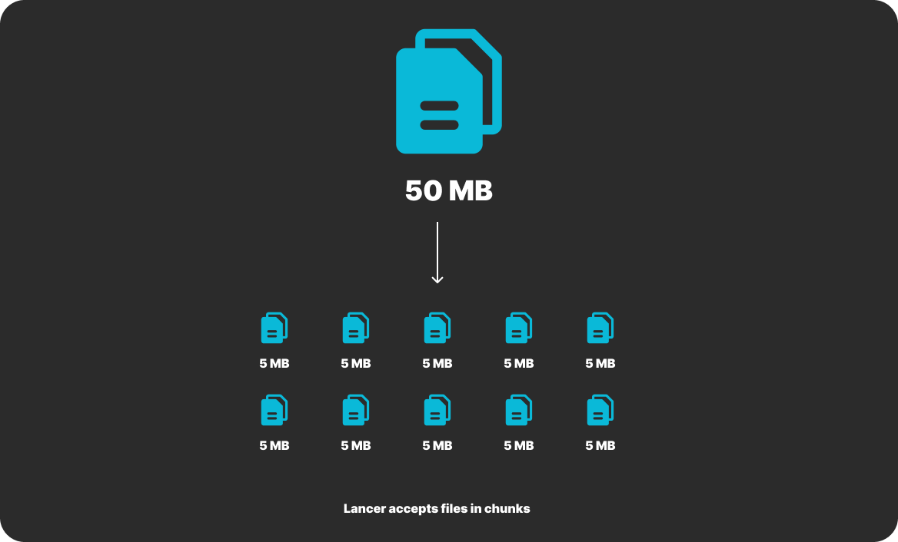

**Info: This documentent primarily focuses on library authors. If you want to integrate Lancer into your application please checkout [SDK & Packages](/docs/quickstart.md) page**

Every file upload starts with a session in `Lancer`. Basically Lancer handle things in chunks by default.



## Prerequisites

Before you start, ensure the following:

- Lancer server is running and accessible.
- A file to upload

You'll also need :
- **Axios** : Install Axios for making HTTP requests.

    ```bash
    npm install axios
    ```

The first step is to create an upload session. This session will hold metadata about the file and the upload process. The server will return a sessionToken that is used for subsequent chunk uploads.

### API Endpoint

**POST** `/api/session`

#### Request Payload

```json
{
  "file_size": 10485760,     // File size in bytes
  "file_name": "example.txt", // Name of the file
  "max_chunk": 2,            // Total number of chunks
  "chunk_size": 5242880,     // Size of each chunk in bytes
  "provider": "LOCAL"        // Storage provider ("LOCAL" or "AWS")
}
```

#### Example Code

```javascript
import axios from "axios";

const API = "http://localhost:8080"; // Base API URL
const CreateSessionEndpoint = API + "/api/sessions";

async function createUploadSession(file) {
  const baseChunkSize = 5 * 1024 * 1024; // Default chunk size: 5 MB
  const totalChunks = Math.ceil(file.size / baseChunkSize);

  const response = await axios.post(
    CreateSessionEndpoint,
    {
      file_size: file.size,
      file_name: file.name,
      max_chunk: totalChunks,
      chunk_size: baseChunkSize,
      provider: "LOCAL",
    },
    {
      headers: {
        Authorization: "Bearer <YOUR_ACCESS_TOKEN>", // Replace with a valid token
      },
    }
  );

  return response.data.sessionToken; // Extract the session token
}
```